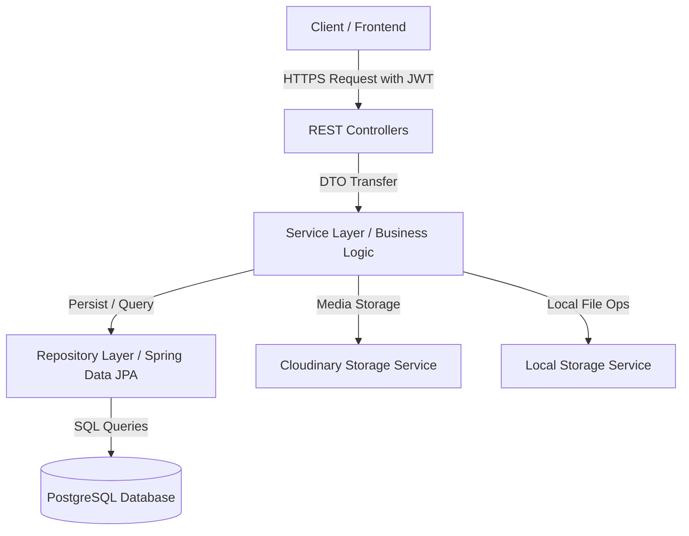

# 🍔 FoodDelivery Backend Application

A robust, high-performance, and secure backend REST API for a **Food Delivery Platform**, built using **Spring Boot 3.x / 4.x**, **Spring Security (JWT)**, **Spring Data JPA**, and **PostgreSQL**. The application supports user authentication, role-based access control, restaurant management, food item catalogs, order placements, delivery tracking, and cloud-based media storage using **Cloudinary**.

---

## 🏗️ Architecture Overview

The codebase is structured following the clean, industry-standard layered architecture pattern, separating concerns into controllers, services, repositories, configurations, and data models:



### 📂 Directory & Package Structure

*   **`Configs/`**: Application configuration beans including Cloudinary setup, custom MVC configs, and Spring Security configurations.
*   **`Controllers/`**: Rest controllers exposing API endpoints for clients (e.g., Auth, Users, Restaurants, Orders).
*   **`Entities/`**: JPA models representing database tables, mappings, and relationships.
*   **`Repositories/`**: Interfaces extending `JpaRepository` for data access.
*   **`Services/`**: Interfaces and their implementations (`impl/`) containing core business logic (e.g., User management, Restaurant setup, File storage).
*   **`Security/`**: JWT utility classes, authentication entry points, and custom JWT filters.
*   **`Payloads/`**: Data Transfer Objects (DTOs) organized into `Requests/` and `Responses/` to abstract the entity representation from the API layer.
*   **`Mappers/`**: MapStruct and custom mappers to map between DTOs and JPA Entities cleanly.
*   **`Exceptions/`**: Custom application exceptions and a central `@RestControllerAdvice` (`GlobalExceptionHandler`) to format and return user-friendly errors.
*   **`Utils/`**: Utility classes, role constants, and customized helper methods.

---

## 📊 Database Schema & Relationships

The database consists of relational models managed by Hibernate (`ddl-auto=update`). Below is the entity relationship diagram:

```mermaid
erDiagram
    foodie_user {
        Long id PK
        String name
        String email UK
        String password
        String phoneNumber
        boolean available
        Address address EMBEDDED
        LocalDateTime createdAt
        LocalDateTime updatedAt
    }
    Authorities {
        Long id PK
        String authority
    }
    foodie_restaurant {
        Long id PK
        String name
        String banner
        String description
        Address address EMBEDDED
        LocalTime openingTime
        LocalTime closingTime
        boolean open
        Long created_by FK
        LocalDateTime createdAt
        LocalDateTime updatedAt
    }
    food_item {
        Long id PK
        String name
        String description
        BigDecimal basePrice
        Unit unit
        String variationName
        BigDecimal weightKg
        Integer quantity
        BigDecimal availableStock
        Long restaurant_id FK
        LocalDateTime createdAt
    }
    orders {
        Long id PK
        Long user_id FK
        Long restaurant_id FK
        BigDecimal totalPrice
        LocalDateTime orderTime
        OrderStatus status
    }
    order_item {
        Long id PK
        Long order_id FK
        Long food_item_id FK
        Unit unit
        BigDecimal quantity
        BigDecimal price
    }
    delivery_status {
        Long id PK
        Long order_id FK
        Long delivery_boy_id FK
        DeliveryStatuses status
        LocalDateTime updatedAt
    }

    foodie_user ||--o{ foodie_restaurant : "creates"
    foodie_user ||--o{ orders : "places"
    foodie_user ||--o{ user_role : "has"
    Authorities ||--o{ user_role : "has"
    foodie_restaurant ||--o{ food_item : "offers"
    foodie_restaurant ||--o{ orders : "receives"
    orders ||--o{ order_item : "contains"
    food_item ||--o{ order_item : "included_in"
    orders ||--o{ delivery_status : "tracked_by"
    foodie_user ||--o{ delivery_status : "delivered_by"
```

### 📋 Enums and Embedded Objects
*   **`Address` (Embedded)**: Encapsulates `city`, `state`, `zipCode`, and `country`.
*   **`Unit`**: `KG`, `QUANTITY`, `BOTH`
*   **`OrderStatus`**: `PLACED`, `PREPARING`, `OUT_FOR_DELIVERY`
*   **`DeliveryStatuses`**: `ASSIGNED`, `PICKED_UP`, `DELIVERED`, `CANCELLED`

---

## 🔒 Security & Authentication

The project uses **Spring Security** combined with **JSON Web Tokens (JWT)** for stateless, secure authentication:

1.  **Authentication Filter (`JwtAuthenticationFilter`)**: Intercepts request headers, parses the JWT bearer token, validates the signature, and sets the authenticated user context in the `SecurityContextHolder`.
2.  **Authentication Entry Point (`JwtAuthnticationPoint`)**: Returns a custom unauthorized payload when unauthenticated users attempt to access protected endpoints.
3.  **Token Refreshing**: Exposes an endpoint to generate a new short-lived Access Token using a longer-lived Refresh Token.
4.  **Role-Based Access Control**:
    *   `ADMIN`: Full privileges, including updating restaurant structures, deleting users, uploading images, etc.
    *   `CUSTOMER`: Can query restaurants, place orders, and manage their profile.
    *   `DELIVERY_BOY`: Assigned to manage order delivery statuses.

---

## 🚀 API Endpoints

### 🔑 Authentication (`/api/v1/auth`)
| HTTP Method | Endpoint | Description | Access |
| :--- | :--- | :--- | :--- |
| `POST` | `/api/v1/auth/signin` | Sign in with email & password, returns JWT tokens | Public |
| `POST` | `/api/v1/auth/refresh-token` | Obtain new Access Token using Refresh Token | Public |

### 👤 User Management (`/api/v1/users`)
| HTTP Method | Endpoint | Description | Access |
| :--- | :--- | :--- | :--- |
| `POST` | `/api/v1/users` | Register a new user account | Public |
| `GET` | `/api/v1/users` | Retrieve all users (paginated, sorted) | Public |
| `GET` | `/api/v1/users/{userId}` | Retrieve details of a specific user | Public |
| `DELETE` | `/api/v1/users/{userId}` | Delete a user account | Admin Only |

### 🍳 Restaurant Management (`/api/v1/restaurants`)
| HTTP Method | Endpoint | Description | Access |
| :--- | :--- | :--- | :--- |
| `POST` | `/api/v1/restaurants` | Create a new restaurant | Authenticated |
| `GET` | `/api/v1/restaurants` | Fetch all restaurants (paginated, sorted) | Public |
| `GET` | `/api/v1/restaurants/{restaurantId}` | Fetch details of a specific restaurant | Public |
| `GET` | `/api/v1/restaurants/open` | Fetch list of open/closed restaurants | Public |
| `PUT` | `/api/v1/restaurants/{restaurantId}` | Update restaurant details | Admin Only |
| `POST` | `/api/v1/restaurants/upload-banner/{restaurantId}` | Upload restaurant banner to Cloudinary | Admin Only |
| `GET` | `/api/v1/restaurants/{restaurantId}/get-banner` | Download/Get restaurant banner image | Public |

---

## 🛠️ Installation & Setup

### 📋 Prerequisites
*   **Java 17** or higher installed.
*   **Maven 3.8+** installed.
*   **PostgreSQL** database instance running.
*   A **Cloudinary** account (for cloud-based file uploads).

### ⚙️ Step 1: Environment Variables
Create a file named `.env` in the root folder of the project (adjacent to `pom.xml`) with your Cloudinary credentials:

```properties
CLOUDINARY_CLOUD_NAME=your_cloudinary_cloud_name
CLOUDINARY_API_KEY=your_cloudinary_api_key
CLOUDINARY_API_SECRET=your_cloudinary_api_secret
```

### ⚙️ Step 2: Database Setup
Update the datasource parameters in `src/main/resources/application.properties` if your PostgreSQL setup requires a different username, password, or host:

```properties
spring.datasource.url=jdbc:postgresql://localhost:5432/food_delivery
spring.datasource.username=your_postgres_username
spring.datasource.password=your_postgres_password
```

### 📦 Step 3: Build & Run
Compile the application and run it using the Spring Boot Maven plugin:

```bash
# Clean and build the application
./mvnw clean install

# Run the Spring Boot application
./mvnw spring-boot:run
```

The application will launch on **`http://localhost:8080`** by default.

---

## 📦 Key Libraries & Technologies
*   **Spring Boot 4.0.2**: Core framework.
*   **Spring Security**: Role-based access control and JWT-based authentication.
*   **Spring Data JPA / Hibernate**: ORM mapping and PostgreSQL database access.
*   **Lombok**: Reduces boilerplate code (Getters, Setters, Builders, etc.).
*   **Cloudinary SDK**: Remote banner upload and cloud media storage.
*   **MapStruct & ModelMapper**: Clean data mappings between Entities and DTOs.
*   **Spring Dotenv**: Auto-loads `.env` values directly into Spring configuration fields.
